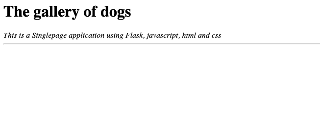
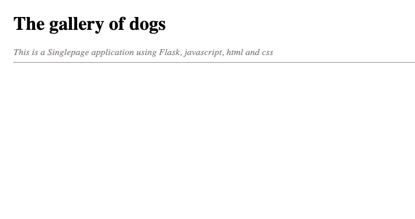

# learning-flask
First looks into Flask

## Start in Develop
```commandline
FLASK_ENV=development FLASK_APP=src/application.py flask run

```
## Jinja-template
https://overiq.com/flask-101/basics-of-jinja-template-language/

##TODO
### Basis
1. template einbinden
2. main-styles.css
3. api: gibt dictionary(json) zurück  
1. template einbinden done
2. main-styles.css    done
3. api: gibt dictionary(json) zurück  done
4. javascript einbinden, was folgende Feature z.b implementiert:
    1. Button "Hello"
    2. Klick auf "Hello" => javascriot funktion doHello aufrufen und einen Modal (alert) "Hello world" anzeigem

### Stufe 2
1. für dictionary eigenen datei ablegen 

## Single Page mit css, javascript and template
## Neue Template
1. Ertelle neue Templates static/dogs.html
```
<html lang="en">
  <head>
    <meta charset="UTF-8" />
    <title>Dogs</title>
  </head>
  <body>
    <div>
      <h1>The gallery of dogs</h1>
      <em>This is a Singlepage application using Flask, javascript, html and css</em>
      <hr/>
    </div>
  </body>
</html>

```
2. Erstelle neue Funktion und Route in application.py
```
@app.route("/dogs/")
def dogs_index():
    return render_template('dogs.html')
```

3. start Flask:
```
FLASK_ENV=development FLASK_APP=src/application.py flask run
```
4. öffne in Browser http://127.0.0.1:5000/dogs/


### CSS Datei erstellen und einbinden
1. static/dogs.css
```
body {
    padding: 24px;
}
em {
  color: #857f7f;
}
```
2. dogs.html
```
...
  <head>
    ...
    <link rel="stylesheet" href="{{ url_for('static', filename='dogs.css') }}">
    ...
  </head>
...  
```
4. Browser aktuallisieren


# create dependency file
```
pip freeze > requirements.txt
```
## Auf Heroku hosten
siehe https://stackabuse.com/deploying-a-flask-application-to-heroku/
1. erstelle neuen Python Daten auf Projekt-Root wsgi.py:
```
from src.main import *
if __name__ == "__main__":
  app.run()
```
2. installiere  gunicorn
```
pip install gunicorn
```
3. erstelle requirements.txt
```
pip freeze > requirements.txt
```
für Flask benötigte Libraries sieht so aus:
```
click==8.0.3
Flask==2.0.2
Flask-Cors==3.0.10
gunicorn==20.1.0
itsdangerous==2.0.1
Jinja2==3.0.3
MarkupSafe==2.0.1
names==0.3.0
Werkzeug==2.0.2
```
4. Erstelle Profile
```
web: gunicorn wsgi:app
```
### URL: https://demo-flask-learning.herokuapp.com/gallery/dogs